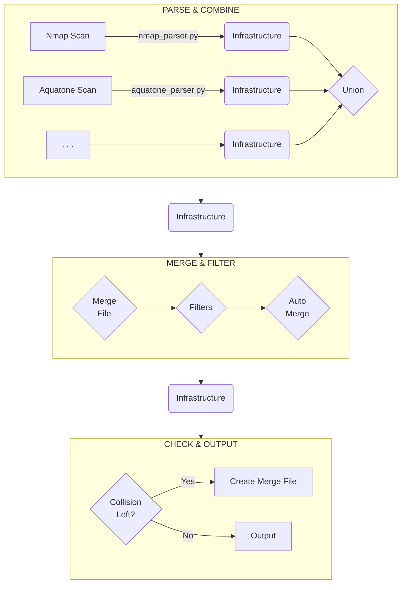

scans2any processes one or more scan files through a three-phase pipeline: it parses inputs into a unified in-memory model, resolves conflicts and applies filters, then either writes output or prompts the user to fix remaining collisions. Understanding this architecture makes it easier to add parsers, extend filters, or debug unexpected merge behavior.

## Pipeline overview



## Phase 1: Parse & Combine

Each input file is processed by its dedicated parser (for example, `nmap_parser.py` or `aquatone_parser.py`). Every parser produces an `Infrastructure` object. Once all files are parsed, the resulting `Infrastructure` objects are unioned into a single combined `Infrastructure`.

The union step preserves all data without any conflict resolution — every service name, banner, and hostname from every source is retained. Conflicts are surfaced and resolved in the next phase.

### Union-Find clustering

Earlier versions of scans2any combined infrastructures by calling `Infrastructure.add_host` in a loop, which performed a linear scan for every host to find merge candidates — O(n²) in the worst case for large inputs.

The current implementation (introduced in v0.8.x) uses an optimized union-find (disjoint set) algorithm implemented in `src/scans2any/internal/clustering.py`. Hosts are grouped into connected components based on shared IP addresses or hostnames. Any two hosts that share a token (IP or hostname) are unioned into the same cluster. Transitively connected hosts — where host A shares an IP with host B, and host B shares a hostname with host C — are all placed in the same cluster and merged exactly once.

Key properties of the implementation:

- **Single-pass clustering**: tokens are processed once; the first host introducing a token becomes its representative, and subsequent hosts sharing it are unioned immediately.
- **Path halving**: the `find` operation uses path halving for near-linear amortized complexity.
- **Deterministic output**: hosts within each cluster are ordered by their original index in the input list, so merges are stable across runs.
- **Optional parallel token indexing**: large inputs can enable `parallel=True` for concurrent token indexing.

The result is near-linear complexity in the number of hosts, with markedly better performance for scans containing thousands of hosts.

## Phase 2: Merge & Filter

After combination, the pipeline resolves collisions and applies filters. A collision occurs when the same port on the same host has multiple detected service names or banners — for example, one scanner reports `http` and another reports `www` for port 80.

### Conflict resolution priority

Conflicts are resolved in the following order (lower numbers are applied first; higher-priority rules overwrite earlier resolutions):

1. **Application-internal auto-merge rules** — built-in rules defined in `src/scans2any/internal/merge-rules.yaml`. For example, the combination `https` + `www` on the same port resolves to `https`.
2. **User-defined auto-merge rules** — rules provided in a merge file under the `auto-merge` key. These match by service name set, optional port constraint, and optionally by banner.
3. **User-defined manual merge rules** — explicit per-host, per-port overrides in a merge file under the `manual-merge` key.

<Note>
  The resolution order in the flowchart above appears reversed because higher-priority rules must be applied first in code — a conflict resolved by a higher-priority rule will not be revisited by lower-priority rules.
</Note>

Filters run in the same phase. They can remove hosts by IP range, strip banner information, or apply other transformations defined by filter plugins.

## Phase 3: Check & Output

After merging and filtering, the pipeline checks whether any collisions remain unresolved (a service port with more than one service name, or more than one banner).

- **If collisions remain**: a `MERGE_FILE.yaml` is written to the current directory (or a temporary file if the directory is not writable), and the user is prompted to resolve the conflicts manually and re-run with `--merge-file MERGE_FILE.yaml`.
- **If no collisions remain**: output is generated in the requested format (Markdown, YAML, HTML, CSV, Typst, etc.).

## Internal data structures

All data is represented using three Pydantic models defined in `src/scans2any/internal/`.

### `Service`

Defined in `service.py`. Represents a single network service on a host.

```python
port: int                    # Numerical port (e.g. 443)
protocol: str                # "tcp" or "udp"
service_names: SortedSet[str]  # e.g. SortedSet(["https"])
banners: SortedSet[str]        # e.g. SortedSet(["Apache httpd 2.4"])
```

`service_names` and `banners` are `SortedSet` instances — a sorted, deduplicated collection. A `SortedSet` with more than one entry in `service_names` or `banners` indicates an unresolved collision for that service.

The `merge_with_service` method resolves conflicts by treating the calling instance as priority. The `union_with_service` method combines both sets without resolution.

### `Host`

Defined in `host.py`. Represents a single network host.

```python
address: SortedSet[str]       # IP addresses (may be empty if hostname-only)
hostnames: SortedSet[str]     # Corresponding hostnames
services: list[Service]       # Available services, sorted by port
os: SortedSet[str]            # Detected operating systems, if available
```

A `Host` must have at least one of `address` or `hostnames`. The `identifier()` method returns the first IP address, or the first hostname if no IP is set — this value is used as the key in merge files.

`merge_with_host` prioritizes the calling host's data when resolving conflicts. `union_with_host` accumulates data from both hosts without resolution. Both methods delegate to the corresponding service-level methods.

### `Infrastructure`

Defined in `infrastructure.py`. Represents the complete set of scanned hosts.

```python
hosts: list[Host]   # All scanned hosts; no two hosts share the same IP
identifier: str     # Human-readable label, e.g. "Nmap scan infrastructure"
```

The `Infrastructure` class owns the combination logic. `add_hosts` calls `cluster_hosts` from `clustering.py` to group all hosts into connected components before merging, avoiding the O(n²) linear scan of earlier versions. `auto_merge` applies the ruleset from `merge-rules.yaml` and any user-supplied rules to resolve collisions automatically. `make_merge_file` collects remaining collisions in a single pass and writes the `MERGE_FILE.yaml` for the user.

<Tip>
  To add a new parser, create a module that returns an `Infrastructure` object populated with `Host` and `Service` instances. The rest of the pipeline — clustering, merging, filtering, and output — operates on `Infrastructure` objects regardless of the source format.
</Tip>
